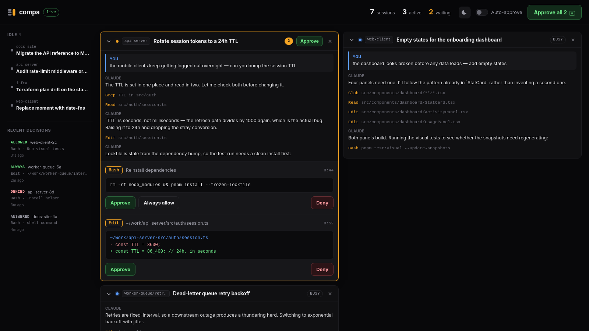
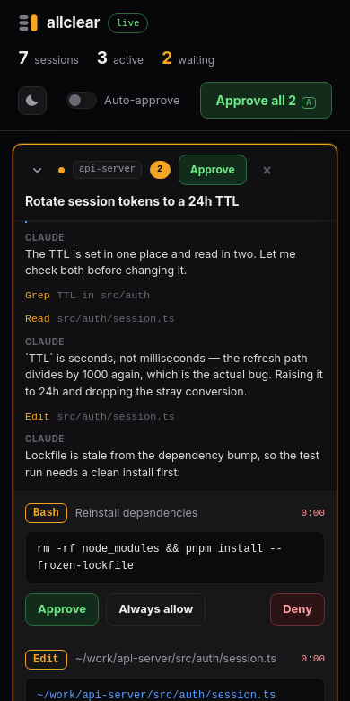

<p align="center">
  
</p>

<h1 align="center">allclear</h1>

<p align="center">
  One browser tab for every Claude Code session you have running —<br>
  see what they're doing, and clear every permission prompt with one click.
</p>

<p align="center">
  <a href="#install"></a>
  = 18">
  
  
</p>

<p align="center">
  
</p>

---

If you keep six terminals open and spend your day hunting for the one stuck on
`Do you want to proceed?`, this is for you. allclear puts every session in one page,
shows you the command, diff or URL each one is waiting on, and lets you answer
them all at once.

## Install

Node 18 or newer. No dependencies, nothing to build.

```bash
npx github:m-peko/allclear
```

That's it. It adds its hooks to `~/.claude/settings.json`, starts a local server
and opens the dashboard. Sessions you already have open pick it up within
seconds — no restart needed.

Or install it properly, so `allclear` is just a command you have:

```bash
curl -fsSL https://raw.githubusercontent.com/m-peko/allclear/main/install.sh | sh
```

That puts the source in `~/.local/lib/allclear` and links `~/.local/bin/allclear`.
It deliberately does **not** touch your Claude Code settings — running `allclear`
afterwards does that — so piping it to a shell can't change how your sessions
behave. Read it first if you'd rather:
[`install.sh`](https://github.com/m-peko/allclear/blob/main/install.sh).
Set `ALLCLEAR_PREFIX` to install somewhere else.

<details>
<summary>Other ways to install</summary>

**With npm**, globally:

```bash
npm install -g github:m-peko/allclear
allclear
```

**From a clone**, if you want to hack on it:

```bash
git clone https://github.com/m-peko/allclear.git
cd allclear
npm link
allclear
```

</details>

To remove it, run `allclear uninstall` (or `npx github:m-peko/allclear uninstall`).
Your settings file is backed up to
`~/.claude/settings.json.allclear-backup-<timestamp>` before anything is written to
it, and only allclear's own hook entries are ever added or removed.

## What you get

**Every session in one place.** Active sessions fill the grid, each showing its
recent conversation — what you asked, what Claude replied, which tools it ran.
Idle ones wait in the sidebar. Each card is titled with the name Claude Code gave
that session and tagged with the repository it's working in.

**Requests you can actually judge.** A pending call is shown in full: the whole
shell command, the real before/after of an edit, the URL being fetched. **Approve
all** (or <kbd>A</kbd>) answers every one on screen — a bulk decision, not a blind
one.

**Nothing silently stuck.** Each request shows how long allclear will hold it. Let it
run out, or quit allclear, and it falls back to the terminal prompt exactly as if
allclear had never been there.

## Commands

| | |
| :-- | :-- |
| `allclear` | Set up if needed, then open the dashboard |
| `allclear start` | Run the dashboard without touching your settings |
| `allclear install` | Add the hooks to `~/.claude/settings.json` |
| `allclear status` | Show hooks, live sessions, and whether the server is up |
| `allclear uninstall` | Remove the hooks |

`--lan` also serves it to your network, for a phone — see below. `--port N` runs
on a different port; pass it to `install` as well, so the hooks point at the right
place. `--no-open` skips opening a browser.

## From your phone



```bash
allclear --lan
```

It prints a link for every address this machine has, and a QR code if you have
`qrencode` installed. Open it on your phone and approve from the sofa.

The layout collapses to a single column, card titles get a line of their own, and
the controls are sized for thumbs.

**This one needs care.** Approving a tool call runs a command on your machine, so
a dashboard anyone on the café wifi can open is a remote shell with a nice UI. So:

- The link carries a token, and every request without it is refused. The token is
  generated once and kept in `~/.claude/allclear-token` (mode `600`) so a bookmark
  keeps working; delete that file to invalidate it and issue a new one.
- The hook endpoints only accept connections from this machine, so nothing on the
  network can fabricate a permission request.
- Without `--lan` the server binds to `127.0.0.1` and no token is involved at all.

Treat the link like a password. If your machine is on a Tailscale or similar
network, `--lan` will print that address too, which gets you to it from anywhere
without exposing it to the local network you happen to be on.

<br clear="right">


## Using it

| | |
| :-- | :-- |
| Click a card header | Folds it shut, keeping its width and place |
| Click the **×** | Takes it off the grid; it waits in the sidebar |
| Click a sidebar row | Puts it back on the grid, open |
| Drag a card's corner | Resizes it — sideways in columns, down for the conversation pane |
| Double-click the corner | Resets that card's size |
| <kbd>A</kbd> | Approves everything on screen |

Card sizes are remembered per session, and the last size you chose becomes the
default for cards that appear later. Dark and light themes are in the top bar,
following your system setting until you pick one.

## How it works

Claude Code fires a [`PermissionRequest`](https://code.claude.com/docs/en/hooks)
hook at the moment it is about to ask you to approve a tool call, and the hook's
response decides the outcome. allclear registers an HTTP hook pointing at its own
local server:

1. A session wants to run something that needs permission.
2. Claude Code POSTs the request to allclear and waits on the response.
3. It appears in your browser, in full.
4. You click. allclear answers the open request, and the session carries on.

Because the decision rides on the hook response, there is no polling and no
keystroke injection — this is the interface Claude Code provides for exactly this
purpose.

Two smaller hooks fill the gaps: `Notification` surfaces the few prompts that
never raise a `PermissionRequest`, such as a sandboxed command's network request,
and `SessionEnd` clears a session's rows when it exits.

### If allclear isn't running

A failed connection to the hook is a non-blocking error in Claude Code: it simply
carries on with its normal permission flow and prompts in the terminal. Stopping
allclear, or never starting it, changes nothing about how your sessions behave.

The same applies to anything allclear is still holding when you quit — every held
request is handed back to the terminal prompt on shutdown.

### Requests you answer in the terminal

Claude Code shows its own prompt while the hook is still pending; whichever
answers first wins. If you answer in the terminal it does **not** close the hook's
connection, so allclear has no direct way to learn the request is settled.

What gives it away is the session's own status. Claude Code reports `waiting`
while a prompt is up and moves off it once the prompt is gone, so allclear drops a
held request when its session has stopped waiting — either because it watched the
session enter `waiting` and leave it, or because the session has gone fully idle.
A five-second grace period covers the lag. Those appear as `answered` in the
sidebar.

### Timeouts

allclear holds a request for 9 minutes (`ALLCLEAR_HOLD_MS`), just under the hook's
10-minute timeout, then releases it to the terminal prompt. Each card shows the
time remaining, so nothing is left waiting on a browser tab you closed.

### Finding your sessions

Live sessions come from `~/.claude/sessions/*.json`, which Claude Code maintains
per process. Those files are never cleaned up, so allclear filters them: a record
counts as live only if its pid exists **and** the process start time still matches
the `procStart` recorded in the file, which rules out a recycled pid. On a machine
with 131 session files, that typically leaves the 8 that are genuinely running.

### Titles and repositories

Claude Code names a session with an `ai-title` record in the transcript, rewritten
as the conversation moves on, so the last one in the file is the current title.
The repository badge is resolved by walking up from the session's working
directory to the nearest `.git`. A worktree under
`<repo>/.claude/worktrees/<name>` has its own `.git` file pointing back at the
real repository, so that suffix is stripped first and the badge reads
`repo/worktree`.

### The conversation view

Expanded cards show the tail of the session's transcript from
`~/.claude/projects/<slug>/<id>.jsonl`. Those files routinely pass several
megabytes, so allclear never reads one whole — it seeks to the last 256KB, walks
backwards until it has enough turns, and caches the result against the file's size
and mtime. Subagent chatter and tool-result plumbing are filtered out.

Transcripts are read from disk and sent to your own browser over localhost. They
are not written to, and nothing leaves your machine.

## About approving everything

**Approve all** grants every request currently on screen. They are all rendered in
full first, so it is a bulk decision rather than a blind one.

**Auto-approve** is a different thing, and the toggle asks you to confirm before it
turns on. While it is on, requests are granted the instant they arrive and you
never see them — including commands that delete files, rewrite history or reach
the network. It is the dashboard's equivalent of
`--dangerously-skip-permissions`, applied to every session at once. Leave it off
unless you know exactly what is running.

**Always allow** writes a permanent rule into `.claude/settings.local.json`, using
the rule Claude Code itself suggested for that request — the same thing the
terminal's "Yes, and don't ask again" does.

## Scope

By default the server binds to `127.0.0.1` only. `--lan` opens it to the network
and always requires a token — see [From your phone](#from-your-phone). Don't put
it behind a public tunnel: the token is a reasonable guard on a home or office
network, not on the open internet.

Session discovery reads `/proc` on Linux and falls back to a signal probe
elsewhere; the rest is platform-independent.

## License

MIT
